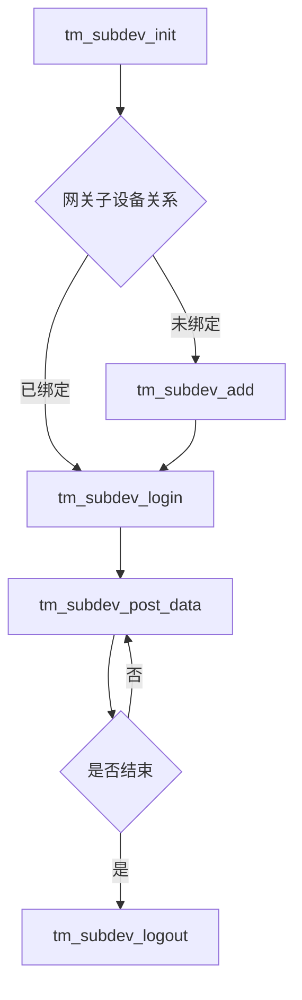

# MQTT协议 OneJson SDK

## 1.使用方法
### 1) 创建产品和设备
首先需要到[OneNET](https://open.iot.10086.cn/)平台注册账号并登录.
先在[OneNET产品管理界面](https://open.iot.10086.cn/studio/device/productManage)创建产品,接入协议选择MQTT,数据格式选择OneJson.

然后在[OneNET设备管理界面](https://open.iot.10086.cn/studio/device/deviceManage)创建设备,并指定到刚才创建的产品下.在设备界面记录下设备名称，设备密钥，产品ID等几个参数

### 2)修改设备参数
将examples/things_model/main.c文件中的设备名称，设备密钥，产品ID等参数修改为实际参数
### 3）编译方法
本SDK使用cmake编译，编译方法如下:
``` shell
    mkdir build
    cd build
    cmake ..
    cmake --build .
```
windows系统下编译步骤相同，但需要先自行移植平台文件

### 4) 编译工具安装
需要安装cmake和gcc编译器以及make

### 5) 使用VSCode进行调试

在VSCode调试文件中配置gdb
``` json
    {
        "name": "mqtts_onejson_soc",
        "type": "cppdbg",
        "request": "launch",
        "program": "${workspaceFolder}/build/mqtts_onejson_soc",
        "args": [],
        "stopAtEntry": false,
        "cwd": "${workspaceFolder}",
        "environment": [],
        "externalConsole": false,
        "MIMode": "gdb"
    }
```

## 2.物模型相关文件
物模型相关文件examples/things_model/tm_user.c，examples/things_model/tm_user.h可替换为实际使用的物模型文件

## 3.支持的平台
本SDK用于linux平台,可修改platforms文件夹添加对其它平台的支持.

## 4.网关子设备

子设备接口参见onenet/tm/tm_subdev.h

在cmake文件中，打开网关与子设备使能
```C
    -DCONFIG_TM_GATEWAY=1
```




## 5.OTA升级